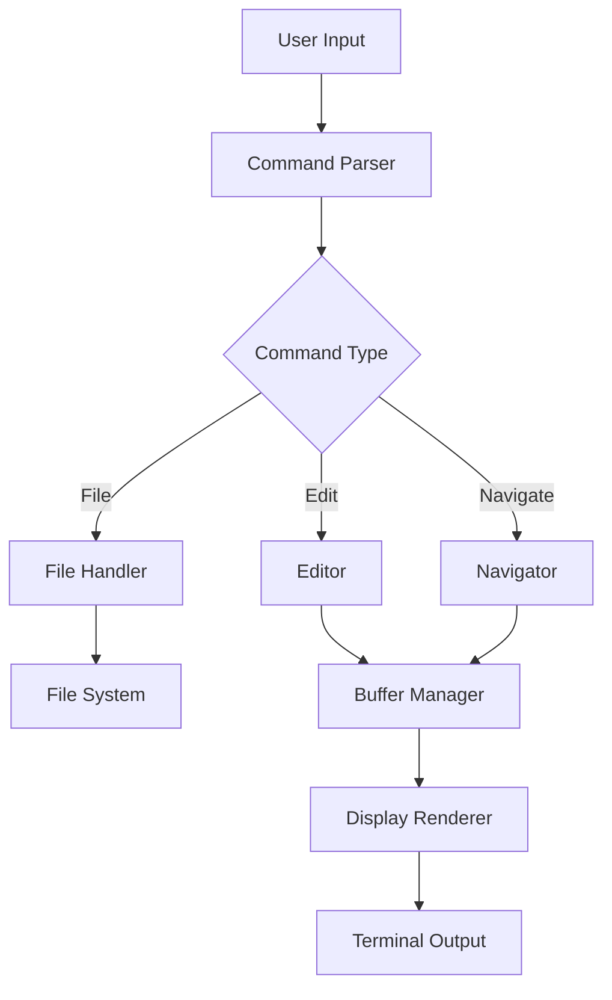

# SUR Editor Project Specification

## 1. Core Components

### 1.1 File Format Handler
- [x] Parser for .sur files
- [x] Writer/serializer for .sur format
- [x] Validator for file structure and content
- [x] Support for comments and metadata

### 1.2 Data Model
- [x] Core data structures implemented
```python
class SURFile:
    metadata: dict  # song name, raag, taal, etc.
    scale: dict    # note mappings
    composition: List[Section]

class Section:
    title: str     # section name (sthayi, antara, etc.)
    beats: List[Beat]

class Beat:
    position: tuple  # (row, beat_number)
    notes: List[Note]
    lyrics: Optional[str]
```

### 1.3 Editor Components
- [x] Text buffer manager
- [x] Cursor position tracker
- [x] Command interpreter
- [x] Display renderer
- [ ] History manager (undo/redo)

## 2. User Interface

### 2.1 Main Interface Elements
- [x] Status bar (current position, mode, etc.)
- [x] Command input area
- [x] Composition display area
- [x] Help/documentation panel

### 2.2 Display Formats
- [x] Linear view (text-based)
- [ ] Grid view (taal pattern based)
- [ ] Section-wise view

## 3. Feature Implementation Plan

### Phase 1: Basic File Operations
- [x] New file creation wizard
  - [x] Prompt for metadata (name, raag, taal, tempo)
  - [x] Scale definition
  - [x] Initial section creation
- [x] File loading
- [ ] File saving
- [x] Basic validation

### Phase 2: Core Editor Features
- [x] Note input/editing
  - [x] Single note entry
  - [x] Multiple note entry
  - [x] Note deletion
  - [x] Note replacement
- [x] Navigation
  - [x] Move by beat
  - [ ] Move by section
  - [ ] Jump to position
- [x] Display
  - [x] Current position indicator
  - [x] Section boundaries
  - [x] Beat markers

### Phase 3: Advanced Features
- [ ] Copy/Paste functionality
  - [ ] Copy range specification
  - [ ] Paste at position
  - [ ] Multiple clipboard support
- [ ] Section management
  - [ ] Add/remove sections
  - [ ] Move sections
  - [ ] Copy sections
- [ ] Pattern operations
  - [ ] Pattern recognition
  - [ ] Pattern duplication
  - [ ] Pattern transformation

## 4. Technical Dependencies

### 4.1 Primary Libraries
```python
dependencies = {
    'click': 'Command line interface',
    'prompt_toolkit': 'Interactive prompts and editor',
    'rich': 'Terminal formatting and colors',
    'pyyaml': 'Configuration handling'
}
```

### 4.2 Development Tools
```python
dev_dependencies = {
    'pytest': 'Testing framework',
    'black': 'Code formatting',
    'mypy': 'Type checking',
    'pylint': 'Code analysis'
}
```

## 5. Command Structure

### 5.1 File Commands
```
new     Create new composition
open    Open existing file
save    Save current file
export  Export to other formats
```

### 5.2 Editor Commands
```
append  Add notes at current position
insert  Insert notes at specific position
delete  Remove notes
replace Replace notes
copy    Copy range of notes
paste   Paste copied notes
```

### 5.3 Navigation Commands
```
goto    Jump to specific position
next    Move to next beat/section
prev    Move to previous beat/section
```

## 6. Data Flow



## 7. Implementation Priority

1. **Foundation (Week 1)**
   - Basic file format parser
   - Data model implementation
   - File operations

2. **Core Editor (Week 2)**
   - Note input/editing
   - Basic navigation
   - Display rendering

3. **Advanced Features (Week 3)**
   - Copy/paste
   - Section management
   - Pattern operations

4. **Polish (Week 4)**
   - UI improvements
   - Help system
   - Error handling

## 8. Testing Strategy

### 8.1 Unit Tests
- Parser/serializer
- Command interpreter
- Data model operations

### 8.2 Integration Tests
- File operations
- Editor operations
- Navigation

### 8.3 User Acceptance Tests
- Common usage patterns
- Error handling
- Performance with large files

## 9. Future Enhancements

- MIDI export/import
- Audio playback
- Visual notation rendering
- Collaborative editing
- Cloud storage integration
- Version control integration